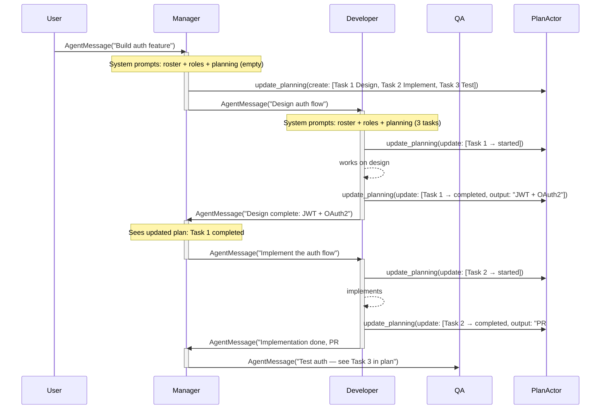
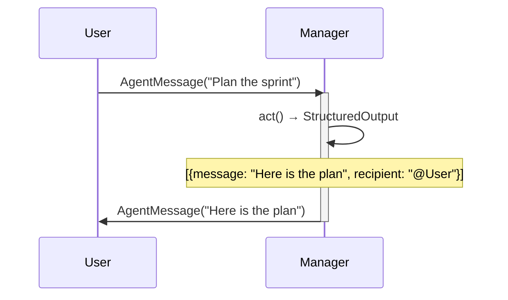
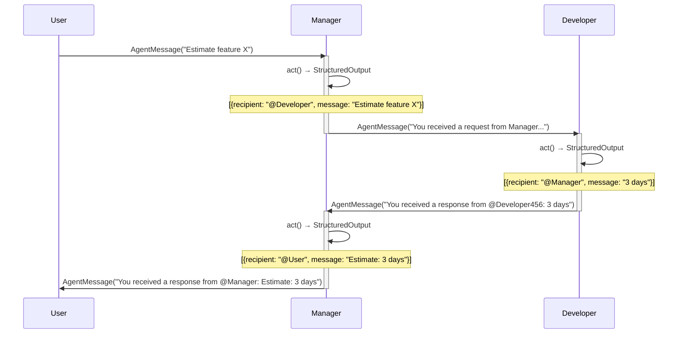
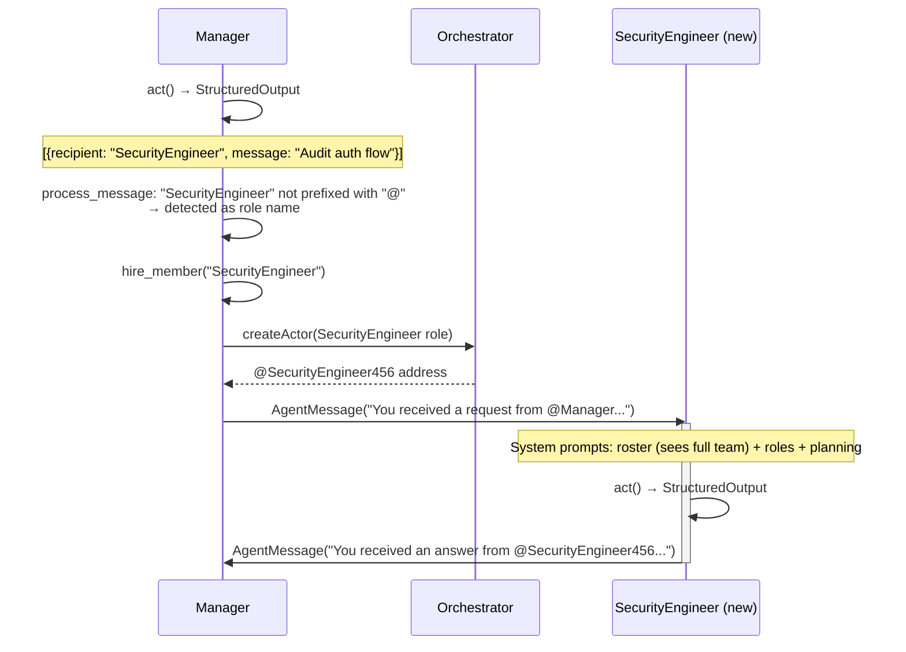
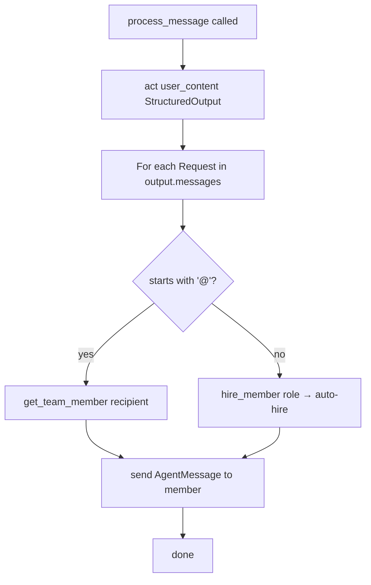
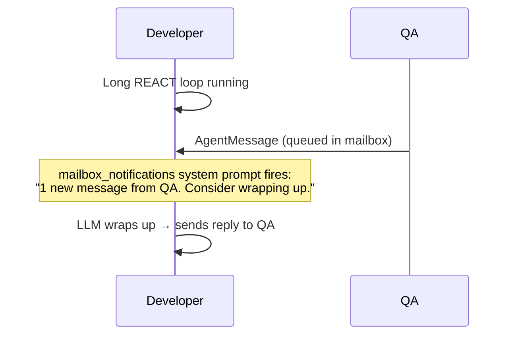

# Agent Collaboration: LLM-Driven Multi-Agent Communication

## Table of Contents

- [Business Need](#business-need)
- [Core Concept](#core-concept)
- [Architecture Overview](#architecture-overview)
- [Collaboration Tools: TeamTool and PlanningTool](#collaboration-tools-teamtool-and-planningtool)
- [Flow Diagrams](#flow-diagrams)
- [Key Implementation](#key-implementation)
- [Usage Examples](#usage-examples)
- [Best Practices](#best-practices)
- [Comparison with akgentic-team](#comparison-with-akgentic-team)
- [API Reference](#api-reference)

---

## Business Need

### The Challenge: Simplifying Multi-Agent Routing

`akgentic-team` solved multi-agent collaboration with a **continuation call stack** — a
framework mechanism that tracked the exact chain of requests and automatically routed
answers back through it. Powerful, but the complexity lived in the framework:
developers had to understand `HelpRequestMessage`, `HelpAnswerMessage`, `Continuation`,
and the `current_idx` pointer to reason about message flow.

`akgentic-agent` shifts the routing responsibility to the LLM itself. The framework
stays minimal; the agent knows who it is talking to and produces explicit, directed
messages:

**Without LLM-driven routing (akgentic-team):**

- ✅ Automatic answer routing through the chain
- ❌ Developers must understand `Continuation` mechanics
- ❌ Two message types (`HelpRequestMessage`, `HelpAnswerMessage`) add model complexity
- ❌ Framework owns the routing graph; the LLM is unaware of it

**With LLM-driven routing (akgentic-agent):**

- ✅ Single `AgentMessage` type — vastly simpler model
- ✅ The LLM reasons about routing; conversation context is visible to it
- ✅ Hire-by-role: LLM addresses a _role_ and the framework hires automatically
- ✅ Transparent to the LLM — it sees the conversation history, not a hidden call stack
- ✅ Schema-constrained recipients prevent invalid routing at generation time

### Real-World Scenarios

#### Scenario 1: Feature Estimation

```
User: "Estimate the effort for dark-mode support."
  ↓
Manager: LLM decides → sends AgentMessage to "Frontend Developer" (role)
  → Framework hires a FrontendDeveloper actor automatically
  ↓
FrontendDeveloper: LLM decides → sends AgentMessage back to "@Manager"
  ↓
Manager: LLM decides → sends AgentMessage back to "@User"
```

The LLM at each step decides the recipient explicitly. No hidden call stack.

#### Scenario 2: Parallel Information Gathering

```
Manager receives: "What is the status of auth and payments?"
  ↓
Manager LLM output: StructuredOutput([
    {message: "Status of auth?",     recipient: "@AuthDev"},
    {message: "Status of payments?", recipient: "@PaymentsDev"},
])
  → Framework delivers both messages concurrently
  ↓
Both agents reply to "@Manager" when done
  ↓
Manager consolidates answers and replies to the original sender
```

The LLM naturally expresses fan-out delegation. The continuation model would have
required multiple sequential `HelpRequestMessage` instances.

---

## Core Concept

### The LLM as Router

Each agent invocation produces a `StructuredOutput` — a list of zero or more
`Request` objects:

```python
class Request(BaseModel):
    message: str    # What to say
    recipient: str  # Who to say it to
```

The `recipient` field drives all routing logic in `process_message()`:

| Recipient format | Meaning                      | Framework action    |
| ---------------- | ---------------------------- | ------------------- |
| `@MemberName`    | Existing team member by name | Direct send         |
| `RoleName`       | Role not yet hired           | Auto-hire then send |

Recipients are **schema-constrained** at generation time: `_build_structured_output_type()`
creates a per-call `Request` subclass where the `recipient` field is restricted to an enum
of valid `@member` names and available role names. Invalid recipients are prevented by the
JSON schema sent to the LLM, not caught after the fact.

### Context is the "Call Stack"

Where `akgentic-team` maintained a `Continuation` object tracking who asked whom,
`akgentic-agent` relies on `ReactAgent`'s `ContextManager`. Every message an agent
sends or receives is appended to its LLM conversation history. When the agent is
invoked again (after a collaborator replies), the full dialogue is available in context.

The LLM itself observes the conversation graph and decides what to do next — no hidden
index pointer, no framework-managed stack.

---

## Architecture Overview

### Component Hierarchy

```
┌─────────────────────────────────────────────────────────────────────┐
│                    Message (akgentic-core)                          │
│                    Base message for all types                       │
└─────────────────────────────┬───────────────────────────────────────┘
                              │
                   ┌──────────▼──────────┐
                   │    AgentMessage     │
                   │  content: str       │
                   │  recipient:         │
                   │    ActorAddress     │
                   └──────────┬──────────┘
                              │
              ┌───────────────┴─────────────────┐
              │                                 │
   ┌──────────▼──────────┐          ┌───────────▼──────────┐
   │  receiveMsg_        │          │  process_human_input │
   │  AgentMessage()     │          │  (HumanProxy)        │
   │  (BaseAgent)        │          └──────────────────────┘
   └──────────┬──────────┘
              │
   ┌──────────▼──────────┐
   │  process_message()  │  ← Core routing engine
   └──────────┬──────────┘
              │
   ┌──────────▼──────────┐
   │  act()              │  ← ReactAgent.run_sync(StructuredOutput)
   └──────────┬──────────┘
              │
   ┌──────────▼──────────────────────────────────────────────────┐
   │  StructuredOutput                                           │
   │  messages: list[Request({message, recipient})]              │
   └──────────┬──────────────────────────────────────────────────┘
              │
     For each Request:
     ┌─────────────────────────────────────────────────────┐
     │ recipient starts with "@"? → direct send to member   │
     │ recipient is a role name?  → auto-hire + send        │
     └─────────────────────────────────────────────────────┘
```

### Data Model

```python
class AgentMessage(Message):
    """Single message type for all inter-agent communication."""
    content: str  # Message body (the only field added over Message)

class Request(BaseModel):
    """One entry in the LLM's StructuredOutput."""
    message: str    # Raw message text
    recipient: str  # "@MemberName" or "RoleName"

class StructuredOutput(BaseModel):
    """Complete LLM response: zero or more directed messages."""
    messages: list[Request] = []
```

`AgentMessage` carries only `content`. The target actor address is resolved by
`process_message()` from the `recipient` string in each `Request` — the
message itself does not carry a pre-resolved address.

### ToolFactory & 3-Channel Architecture

Every `BaseAgent` composes a `ToolFactory` that aggregates `ToolCard` instances into
three channels. Each `ToolCard` capability declares which channels it is exposed
through via `expose: set[Channels]`:

| Channel         | Method on `ToolCard`   | Purpose                                                                                |
| --------------- | ---------------------- | -------------------------------------------------------------------------------------- |
| `TOOL_CALL`     | `get_tools()`          | LLM-callable functions (`hire_members`, `fire_members`, `update_planning`)             |
| `SYSTEM_PROMPT` | `get_system_prompts()` | Dynamic prompts injected into LLM context (`team_roster`, `role_profiles`, `planning`) |
| `COMMAND`       | `get_commands()`       | Programmatic API for code and slash-commands (`cmd_hire_member`, `cmd_get_planning`)   |

Two `ToolCard` implementations are central to collaboration — **TeamTool** and
**PlanningTool** — described in the next section.

---

## Collaboration Tools: TeamTool and PlanningTool

Two tools are the pillars of multi-agent collaboration. Both are **`ToolCard`
subclasses** resolved by `ToolFactory` into the three channels above.

### TeamTool — Team Awareness and Composition

`TeamTool` is **automatically injected** by `BaseAgent.on_start()` unless
already present in `config.tools`. It enables the LLM to see who is on the team,
what roles are available, and to hire or fire members.

| Capability            | Default channels           | Description                                                                    |
| --------------------- | -------------------------- | ------------------------------------------------------------------------------ |
| **`GetTeamRoster`**   | `SYSTEM_PROMPT`, `COMMAND` | Injects a live list of team members and their roles into every LLM call        |
| **`GetRoleProfiles`** | `SYSTEM_PROMPT`, `COMMAND` | Injects the full agent catalog (role, description, skills) into every LLM call |
| **`HireTeamMember`**  | `TOOL_CALL`, `COMMAND`     | LLM-callable tool to hire new members by role                                  |
| **`FireTeamMember`**  | `TOOL_CALL`, `COMMAND`     | LLM-callable tool to remove members by name                                    |

**Why it matters for collaboration**: The two `SYSTEM_PROMPT` capabilities
(`GetTeamRoster` and `GetRoleProfiles`) give the LLM the information it needs to
make routing decisions. At every `act()` call, the LLM sees:

```
**Team members:**
@Manager (role: Manager) - [you]
@Developer456 (role: Developer)
@QA789 (role: QA)

**Available team roles:**
Manager: Helpful manager coordinating team work (Skills: coordination, delegation)
Developer: Full-stack developer (Skills: coding, architecture)
QA: Quality assurance engineer (Skills: testing, automation)
```

Combined with the `{team}` and `{roles}` variables injected into the `StructuredOutput`
docstring, the LLM has full team visibility without the developer hard-coding
any team structure into prompts.

### PlanningTool — Coordinating Complex Multi-Agent Work

`PlanningTool` is the key mechanism for **complex, multi-step collaborations**. When
multiple agents must work in sequence or in parallel toward a shared goal, the
planning tool provides a shared, persistent task board backed by a `PlanActor`.

| Capability            | Default channels           | Description                                          |
| --------------------- | -------------------------- | ---------------------------------------------------- |
| **`GetPlanning`**     | `SYSTEM_PROMPT`, `COMMAND` | Injects the full task list into every LLM call       |
| **`GetPlanningTask`** | `TOOL_CALL`, `COMMAND`     | LLM-callable tool to retrieve a single task by ID    |
| **`UpdatePlanning`**  | `TOOL_CALL`                | LLM-callable tool to create, update, or delete tasks |

At every `act()` call, the LLM sees the current plan state:

```
Team planning:
- ID 1 [started] Design auth flow — Output:  (Owner: @Developer456, Creator: @Manager)
- ID 2 [pending] Write integration tests — Output:  (Owner: @QA789, Creator: @Manager)
- ID 3 [completed] Review security requirements — Output: OWASP checklist applied (Owner: @Manager, Creator: @Manager)
```

#### Custom Instructions via `UpdatePlanning`

`UpdatePlanning` accepts an `instructions` parameter that is appended to the tool's
docstring. This lets you inject domain-specific rules that the LLM follows when
updating the plan:

```python
from akgentic.tool.planning import PlanningTool, UpdatePlanning

planning_tool = PlanningTool(
    update_planning=UpdatePlanning(
        instructions="""CRITICAL: Always keep the plan updated.
Create tasks when your task involves other team members
or is complex enough to require multiple steps.
Update task status when you make progress.
Record outputs when you complete work.
Do not finish your turn if the plan is stale."""
    )
)
```

This produces a tool docstring the LLM sees as:

```
Update team tasks (create, update, delete).

Additional Instructions:
CRITICAL: Always keep the plan updated.
Create tasks when your task involves other team members
or is complex enough to require multiple steps.
...
```

#### How TeamTool + PlanningTool Work Together



The planning tool acts as shared memory. Each agent sees the same task list (via
`SYSTEM_PROMPT`), updates it (via `TOOL_CALL`), and other agents observe those
changes on their next invocation.

---

## Flow Diagrams

### 1. Single-Agent Reply



### 2. Two-Hop Delegation (Known Member)



### 3. Hire-by-Role Delegation

When the LLM addresses a recipient that is a role name (no `@` prefix), the
framework hires a new actor of that role before delivering the message.



### 4. process_message() Decision Tree



> **Note:** Recipients are schema-constrained at generation time via
> `_build_structured_output_type()`, so invalid recipients cannot be produced by
> the LLM. The routing logic is a simple two-branch dispatch.

### 5. Mailbox Notification

When an agent is busy processing a long REACT loop and new messages arrive from
other team members, `BaseAgent` surfaces a mailbox notification in the next system
prompt:



---

## Key Implementation

### 1. Message Delivery (process_message)

```python
def process_message(self, message_content: str, sender: ActorAddress) -> None:
    output = self.act(message_content, StructuredOutput)

    for request in output.messages:
        recipient = request.recipient

        member = None
        if recipient.startswith("@"):
            member = self.get_team_member(recipient)
        else:
            member = self.hire_member(recipient)

        if member is not None:
            article = "an" if request.message_type[0] in "aeiou" else "a"
            content = (
                f"You received {article} {request.message_type}"
                f" from {self.config.name}:\n\n"
                + request.message
            )
            self.send(
                member,
                AgentMessage(
                    content=content,
                    type=request.message_type,
                    recipient=member,
                ),
            )
```

Since recipients are schema-constrained by `_build_structured_output_type()`, the routing
logic is a simple two-branch dispatch with no error recovery needed.

### 2. Schema-Constrained Structured Output (_build_structured_output_type)

Each call to `act()` delegates to `_build_structured_output_type()` which creates
per-call Pydantic subclasses with two purposes:

1. **Constrain recipients** — A `Request` subclass restricts `recipient` to an enum
   of valid `@member` names + available role names via `json_schema_extra`. This enum
   appears in the JSON schema sent to the LLM, preventing invalid routing at generation
   time.

2. **Inject per-call context** — A `StructuredOutput` subclass gets a dynamic docstring
   with the sender, message type, reply protocol, team roster, and available roles.

```python
# Per-call Request subclass with constrained recipients
valid_recipients = [f"@{name}" for name in team] + list(roles)
local_request = type("Request", (Request,), {
    "__annotations__": {"recipient": str},
    "recipient": Field(..., json_schema_extra={"enum": valid_recipients}),
})

# Per-call StructuredOutput subclass with context docstring
local_output_type = type(output_type.__name__, (output_type,), {
    "__annotations__": {"messages": list[local_request]},
    "messages": Field(default_factory=list),
    "__doc__": structured_output.format(
        sender=sender,
        message_type=self._current_message.type,
        reply_protocol=REPLY_PROTOCOLS.get(self._current_message.type, ""),
        team=", ".join(team) or "no other members",
        roles=", ".join(roles) or "no roles available",
    ),
})
```

This is thread-safe: each agent's `act()` call creates its own subclass on a separate
Pykka thread.

### 3. Hire-by-Role (hire_member)

When the LLM names a role instead of a `@member`, `process_message` calls
`hire_member(role)` which delegates to `TeamTool`'s `HireTeamMember` command:

```python
def hire_member(self, role: str) -> ActorAddress:
    if self._hire_member_command is None:
        raise RuntimeError("hire_member command not available — TeamTool not configured")
    return self._hire_member_command(role)
```

Internally, `TeamTool` asks the `Orchestrator` to create a new actor of the
requested role and register it in the team roster. The address is returned and
the message is immediately delivered to the newly hired actor.

### 4. Usage Limit Protection

`receiveMsg_AgentMessage` catches `LLMUsageLimitError` and escalates to the first
team member with `role="human"` via `notify_human()`:

```python
except LLMUsageLimitError as e:
    self.notify_human(
        f"The agent {self.config.name} has exceeded its usage limits ({e})."
    )
    raise WarningError(f"LLM usage limit exceeded: {e}")
```

Routing errors are no longer possible at runtime thanks to schema-constrained recipients.

---

## Usage Examples

### Example 1: Minimal Team with Planning

This is the typical setup for a collaborative team. Taken from
[src/agent_team.py](../../src/agent_team.py):

```python
from akgentic.agent import AgentConfig, AgentMessage, BaseAgent, HumanProxy
from akgentic.core import ActorSystem, AgentCard, BaseConfig, Orchestrator
from akgentic.llm import ModelConfig, PromptTemplate
from akgentic.tool.planning import PlanningTool, UpdatePlanning

# PlanningTool with custom instructions for the LLM
planning_tool = PlanningTool(
    update_planning=UpdatePlanning(
        instructions="""CRITICAL: Always keep the plan updated.
Create tasks when your task involves other team members
or is complex enough to require multiple steps.
Update task status when you make progress.
Record outputs when you complete work.
Do not finish your turn if the plan is stale."""
    )
)
tools = [planning_tool]  # add search_tool, knowledge_graph, etc. as needed

# TeamTool is NOT listed here — it is auto-injected by BaseAgent

manager_card = AgentCard(
    role="Manager",
    description="Helpful manager coordinating team work",
    skills=["coordination", "delegation"],
    agent_class="akgentic.agent.BaseAgent",
    config=AgentConfig(
        name="@Manager",
        role="Manager",
        prompt=PromptTemplate(
            template="You are a helpful manager. Coordinate the team effectively.",
        ),
        model_cfg=ModelConfig(provider="openai", model="gpt-4o", temperature=0.3),
        tools=tools,
    ),
    routes_to=["Assistant", "Expert"],  # roles this agent can hire
)

# ... define assistant_card, expert_card similarly ...

actor_system = ActorSystem()
orchestrator_addr = actor_system.createActor(
    Orchestrator, config=BaseConfig(name="@Orchestrator", role="Orchestrator")
)
orchestrator_proxy = actor_system.proxy_ask(orchestrator_addr, Orchestrator)
orchestrator_proxy.register_agent_profiles([manager_card, assistant_card, expert_card])

human_addr = orchestrator_proxy.createActor(
    HumanProxy, config=BaseConfig(name="@Human", role="Human")
)
human_proxy = actor_system.proxy_tell(human_addr, HumanProxy)

manager_addr = orchestrator_proxy.createActor(
    BaseAgent, config=manager_card.get_config_copy()
)

human_proxy.send(manager_addr, AgentMessage(content="Build the auth feature."))
```

### Example 2: LLM Routing Decisions at Runtime

The following shows what happens inside a single `process_message()` call,
not code you write — the LLM produces this output:

```python
# The LLM sees (via TeamTool system prompts):
#   Team members: @Manager [you], @Developer456, @QA789
#   Available roles: Manager, Developer, QA, SecurityEngineer
#
# The LLM returns:
StructuredOutput(messages=[
    # Reply to the original sender
    Request(message="I'll coordinate...", recipient="@Human"),
    # Direct send to existing member
    Request(message="Implement OAuth", recipient="@Developer456"),
    # Hire a new role on demand
    Request(message="Audit auth flow", recipient="SecurityEngineer"),
])

# process_message() resolves each:
# "@Human"             → starts with "@" → get_team_member → direct send
# "@Developer456"      → starts with "@" → get_team_member → direct send
# "SecurityEngineer"   → no "@" → hire_member → send to new actor
```

### Example 3: Waiting for a Collaborator

```python
# Agent cannot proceed until another agent replies.
# LLM returns:
StructuredOutput(messages=[])  # ← empty list

# The agent's turn ends. When @Developer456 replies later,
# receiveMsg_AgentMessage fires again with full context history.
# The LLM sees the previous conversation + the new message
# and continues from where it left off.
```

### Example 4: PlanningTool Driving Complex Collaboration

```python
# Manager's LLM call #1
# Sees: empty plan, team: [@Developer456, @QA789]
# LLM calls update_planning tool:
UpdatePlan(
    create_tasks=[
        TaskCreate(id=1, status="pending", description="Design auth flow", owner="@Developer456"),
        TaskCreate(id=2, status="pending", description="Implement auth", owner="@Developer456",
                   dependencies=[1]),
        TaskCreate(id=3, status="pending", description="Write auth tests", owner="@QA789",
                   dependencies=[2]),
    ]
)
# Then returns:
StructuredOutput(messages=[
    Request(message="Start with Task 1: design the auth flow", recipient="@Developer456"),
])

# Developer's LLM call
# Sees plan: Task 1 [pending], Task 2 [pending], Task 3 [pending]
# LLM calls update_planning:
UpdatePlan(update_tasks=[TaskUpdate(id=1, status="completed", output="JWT + OAuth2 design")])
# Then returns:
StructuredOutput(messages=[
    Request(message="Design complete — JWT + OAuth2. Ready for Task 2.", recipient="@Manager"),
])

# Manager's LLM call #2
# Sees updated plan: Task 1 [completed], Task 2 [pending], Task 3 [pending]
# Routes Task 2 to developer...
```

---

## Best Practices

### ✅ DO

1. **Attach a `PlanningTool` with custom instructions for complex work**

   The `PlanningTool` is the primary coordination mechanism for multi-step,
   multi-agent tasks. Provide explicit `UpdatePlanning.instructions` so the
   LLM keeps the shared plan up to date:

   ```python
   PlanningTool(
       update_planning=UpdatePlanning(
           instructions="""CRITICAL: Always keep the plan updated.
   Create tasks when your task involves other team members
   or is complex enough to require multiple steps.
   Update task status when you make progress.
   Record outputs when you complete work.
   Do not finish your turn if the plan is stale."""
       )
   )
   ```

2. **Let `TeamTool` handle team awareness — don't duplicate it in prompts**

   `TeamTool` is auto-injected and provides `GetTeamRoster` and
   `GetRoleProfiles` as dynamic system prompts. The `StructuredOutput`
   docstring also injects `{team}` and `{roles}`. Writing team member lists
   in prompts is redundant and will drift out of date:

   ```python
   # Wrong: hard-codes team members the LLM can already see
   prompt = "Your team includes @Developer and @QA."

   # Right: describe behavior, not team composition
   prompt = "You are a project manager. Delegate implementation and test tasks."
   ```

3. **Return an empty list when waiting**

   An empty `StructuredOutput(messages=[])` signals the agent's turn is over.
   The agent will be invoked again when the next `AgentMessage` arrives, with
   full context history preserved.

4. **Use `cmd_` commands for programmatic / slash-command operations**

   ```python
   # From agent_team.py interactive loop
   addr = manager_proxy.cmd_hire_member("DevOpsEngineer")
   result = manager_proxy.cmd_fire_member("@DevOpsEngineer456")
   print(manager_proxy.cmd_get_planning())
   print(manager_proxy.cmd_get_team_roster())
   ```

5. **Always include a `HumanProxy` with `role="Human"`**

   `notify_human()` sends escalation messages (usage-limit exceeded,
   recursion error) to the first team member with `role="human"`. Without
   one, error escalations are silently dropped.

### ❌ DON'T

1. **Don't confuse role names with member names**

   ```
   # Wrong: "@" prefix is for existing members, not roles
   recipient: "@Designer"   (if no Designer has been hired yet → member_err)

   # Right: bare role name triggers auto-hire
   recipient: "Designer"
   ```

2. **Don't rely on ordering within `StructuredOutput.messages`**

   The framework delivers all messages but does not guarantee delivery order.
   If ordering matters, use the `PlanningTool` to express task dependencies
   and send one message at a time.

3. **Don't create feedback loops**

   If agent A always messages agent B who always messages agent A, the agents
   will consume usage limits rapidly. Design prompts with clear termination
   conditions. Usage limit protection will eventually escalate to the human.

4. **Don't skip the `PlanningTool` for multi-step work**

   Without a shared plan, agents lack visibility into what others are doing.
   The `SYSTEM_PROMPT` channel ensures every agent sees the current task
   list — this is how agents coordinate implicitly without direct messaging.

5. **Don't add `TeamTool` to `config.tools` manually (unless customizing it)**

   `BaseAgent.on_start()` auto-injects `TeamTool` if absent. Adding it
   explicitly is only needed when overriding defaults (e.g., disabling hire):

   ```python
   # Only if you want to disable hiring:
   tools = [TeamTool(hire_team_members=False), planning_tool]
   ```

---

## Comparison with akgentic-team

| Aspect                   | akgentic-team (deprecated)                               | akgentic-agent                                            |
| ------------------------ | -------------------------------------------------------- | --------------------------------------------------------- |
| **Message types**        | `HelpRequestMessage`, `HelpAnswerMessage`, `UserMessage` | `AgentMessage` only                                       |
| **Routing mechanism**    | Framework `Continuation` call stack                      | LLM `StructuredOutput` recipients                         |
| **Answer routing**       | Automatic via `current_idx` decrement                    | LLM explicitly names sender as recipient                  |
| **Delegation**           | `HelpRequestMessage(owner=target)`                       | `Request(recipient="@Target")`                            |
| **Hire-by-role**         | Via `TeamFactory` at setup time                          | LLM names a role; hired at runtime                        |
| **Context tracking**     | `Continuation.message_path` + `current_idx`              | `ReactAgent.ContextManager` conversation history          |
| **Fan-out (parallel)**   | Multiple sequential `HelpRequestMessage`                 | Single `StructuredOutput` with multiple `Request` entries |
| **LLM visibility**       | LLM unaware of routing graph                             | LLM owns the routing graph                                |
| **Developer complexity** | Must understand `Continuation` mechanics                 | Prompt-level: describe who is in the team                 |

### When the Continuation Model Still Applies

If you need **guaranteed answer routing back** to a specific caller through a
multi-hop chain (audit trail, formal call stack semantics), the continuation
model remains the correct tool. `akgentic-agent` does not implement this
guarantee — the LLM _should_ reply to the right party, but is not forced to.

---

## API Reference

### AgentMessage

```python
class AgentMessage(Message):
    """Single message type for all inter-agent communication.

    Attributes:
        content: The message body.
    """
    content: str
```

`AgentMessage` inherits `id`, `sender`, and `team_id` from `Message`.
It does **not** carry a pre-resolved recipient — the target address is
resolved by `process_message()` from the `Request.recipient` string.

### Request

```python
class Request(BaseModel):
    """A directed message produced by the LLM.

    Attributes:
        message_type: Intent of the message (request, response, notification, etc.).
        message: The message content to send.
        recipient: Target expressed as "@MemberName" or "RoleName".
            Schema-constrained to valid values at generation time.
    """
    message_type: Literal["request", "response", "notification", "instruction", "acknowledgment"]
    message: str
    recipient: str
```

### StructuredOutput

```python
class StructuredOutput(BaseModel):
    """Complete LLM response for one agent invocation.

    An empty list signals the agent is waiting for collaborators.
    A non-empty list triggers message delivery for each entry.

    Attributes:
        messages: Zero or more directed messages.
    """
    messages: list[Request] = []
```

### AgentConfig

```python
class AgentConfig(BaseConfig):
    """Per-agent configuration.

    Attributes:
        prompt: Agent backstory/system prompt (string or PromptTemplate).
        model_cfg: LLM provider and model settings.
        runtime_cfg: Execution parameters (temperature, max tokens, retries).
        usage_limits: Token and request usage constraints.
        max_help_requests: Recursion depth limit for delegation chains (default: 5).
        tools: Additional ToolCard instances exposed to the LLM.
    """
    prompt: PromptTemplate
    model_cfg: ModelConfig
    runtime_cfg: RuntimeConfig
    usage_limits: UsageLimits
    max_help_requests: int = 5
    tools: list[ToolCard] = []
```

### BaseAgent

```python
class BaseAgent(Akgent[AgentConfig, AgentState]):
    """LLM-powered team agent with delegation and collaboration.

    Key methods:

    act(user_content, output_type) -> T
        Execute one LLM REACT loop. Builds schema-constrained output type
        via _build_structured_output_type(), then delegates to ReactAgent.

    process_message(message_content, sender) -> None
        Core routing engine. Calls act(), resolves recipients,
        delivers AgentMessage instances with enriched content.

    receiveMsg_AgentMessage(message, sender) -> None
        Pykka message handler. Entry point for all incoming messages.

    hire_member(role) -> ActorAddress
        Hire a new agent by role via TeamTool. Raises ModelRetry on failure.

    notify_human(message) -> None
        Send an AgentMessage to the first 'human' role in the team.

    cmd_hire_member(role) -> ActorAddress | str
        Programmatic hire; returns error string instead of raising.

    cmd_fire_member(name) -> str
        Programmatic fire; returns confirmation or error string.

    cmd_get_planning() -> str
        Return formatted team planning (requires PlanningTool).

    cmd_get_team_roster() -> str
        Return formatted team roster.

    cmd_get_role_profiles() -> str
        Return available role definitions.
    """
```

### HumanProxy

```python
class HumanProxy(UserProxy):
    """Human-in-the-loop agent serving as telemetry sink and input bridge.

    receiveMsg_AgentMessage(message, sender) -> None
        Telemetry sink: pushes incoming messages into the event system.
        Consumer is pluggable (console, WebSocket, WhatsApp, email, etc.).

    process_human_input(content, message) -> None
        Routes human response back as AgentMessage to the requesting agent.
    """
```

---

## Testing

Run the agent package tests:

```bash
cd packages/akgentic-agent
python -m pytest tests/ -v
python -m pytest tests/ --cov=akgentic.agent
```

---

## Related Documentation

- [akgentic-core Actor System](../../akgentic-core/docs/)
- [akgentic-llm ReactAgent](../../akgentic-llm/docs/)
- [akgentic-tool ToolCard & TeamTool](../../akgentic-tool/docs/)
- [Continuation System (akgentic-team, deprecated)](../akgentic-team/docs/continuation-system.md)
- [Project Architecture](../../docs/architecture.md)

---

## Contributing

When extending the collaboration system:

1. **Maintain `AgentMessage` as the sole inter-agent message type** — do not introduce new types without strong justification
2. **Keep schema constraints in sync** — `_build_structured_output_type()` must reflect the current team roster and available roles
3. **Document prompt patterns** — add examples to this document when new routing patterns are validated
4. **Performance test fan-out** — benchmark with large `StructuredOutput` lists to detect delivery bottlenecks

---

**Questions?** File an issue or contact the Akgentic team.
