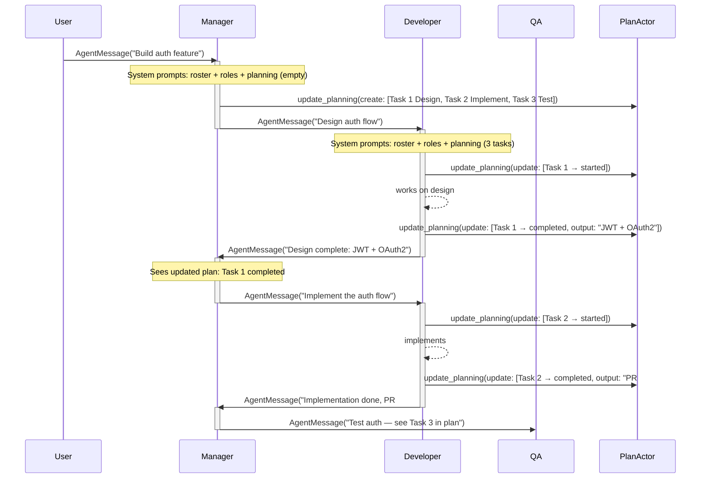
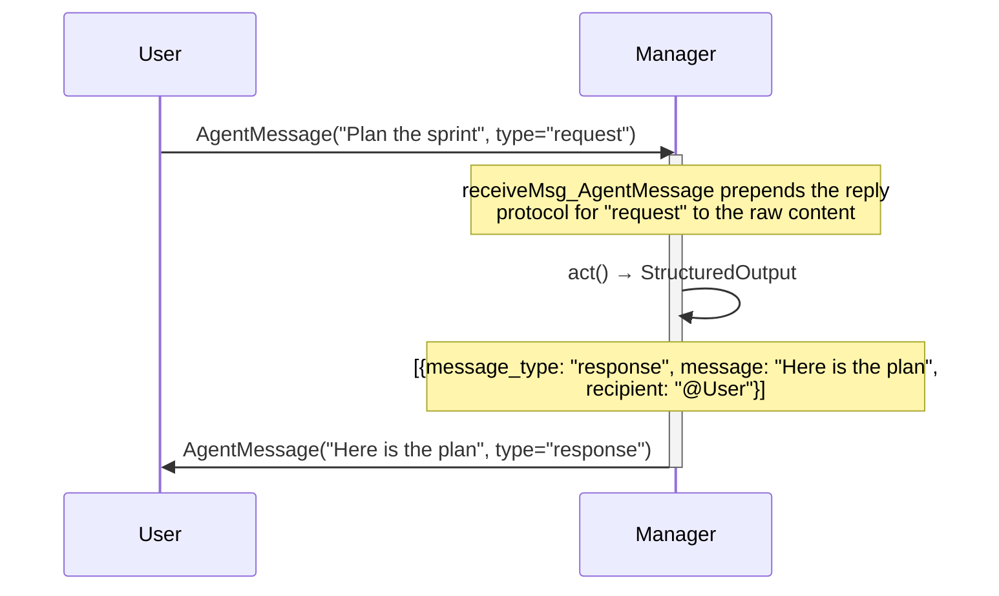
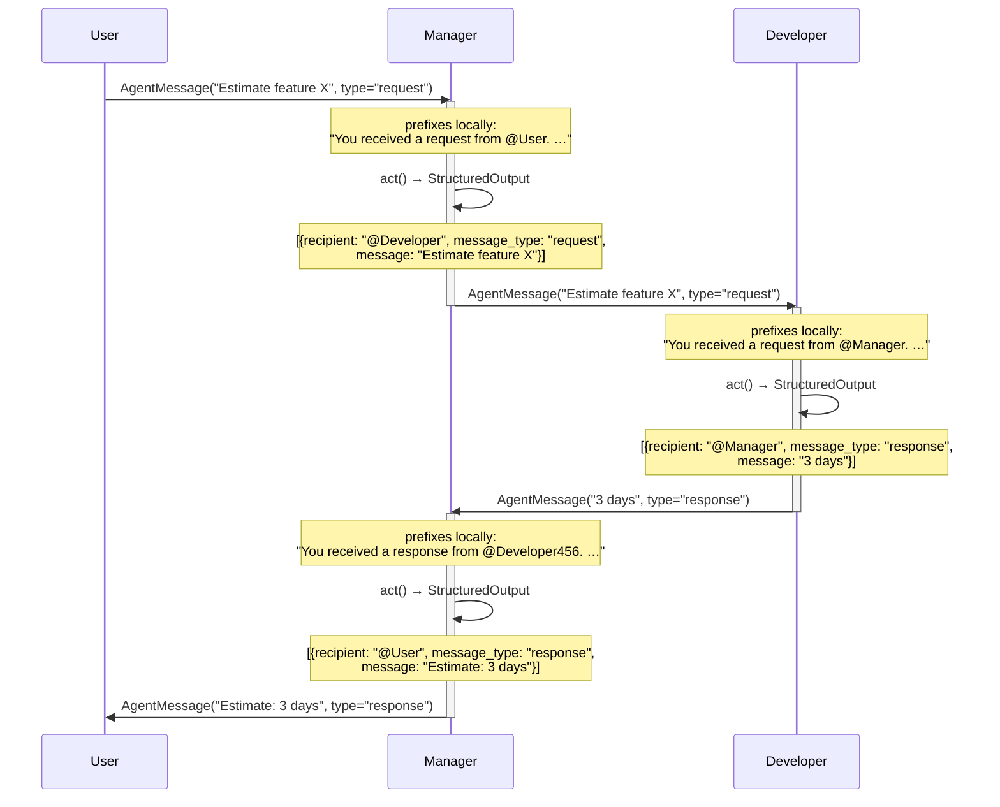
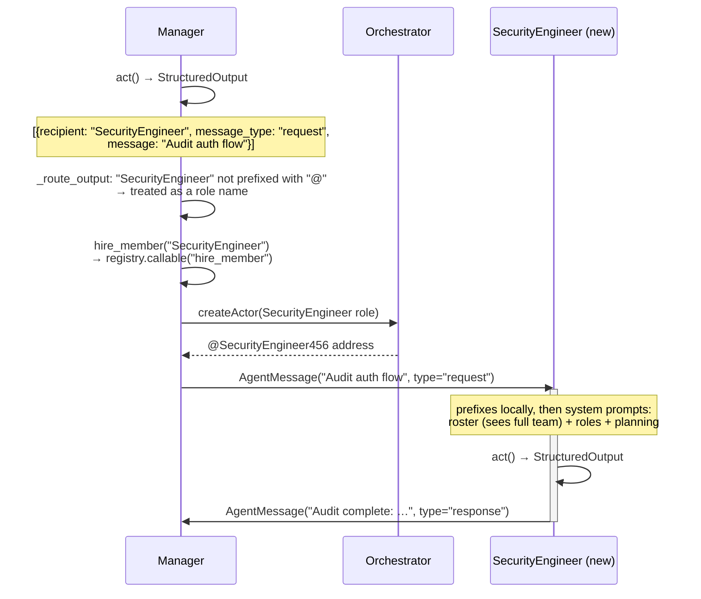
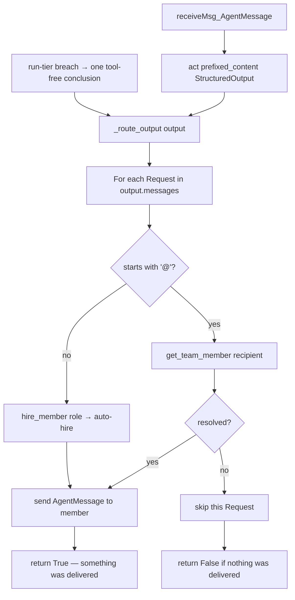

# Agent Collaboration: LLM-Driven Multi-Agent Communication

## Table of Contents

- [Business Need](#business-need)
- [Core Concept](#core-concept)
- [Architecture Overview](#architecture-overview)
- [Collaboration Tools: TeamTool and PlanningTool](#collaboration-tools-teamtool-and-planningtool)
- [Flow Diagrams](#flow-diagrams)
- [Key Implementation](#key-implementation)
- [Usage Examples](#usage-examples)
- [Best Practices](#best-practices)
- [Routing Patterns: Continuation vs. LLM-Driven](#routing-patterns-continuation-vs-llm-driven)
- [API Reference](#api-reference)
- [Testing](#testing)
- [Related Documentation](#related-documentation)
- [Contributing](#contributing)

---

## Business Need

### The Challenge: Simplifying Multi-Agent Routing

A multi-agent system has to decide **who owns routing**. One answer is a framework-managed
**continuation call stack**: the framework records the exact chain of requests and routes every
answer back through it automatically. That guarantees delivery, but the complexity lands on the
developer — reasoning about message flow means reasoning about the framework's bookkeeping.

`akgentic-agent` takes the other answer: routing is the **LLM's** job. The framework stays
minimal, and the agent produces explicit, directed messages.

**What LLM-driven routing buys:**

- ✅ A single `AgentMessage` type — no request/answer message pair to model
- ✅ The LLM reasons about routing, over a conversation history it can actually see
- ✅ Hire-by-role: the LLM addresses a _role_ and the framework hires on demand
- ✅ No hidden call stack — the agent sees the dialogue, not framework state
- ✅ An unresolvable `@member` is skipped at routing time instead of failing the run

**What it costs:** nothing *forces* the LLM to reply to the right party. See
[Routing Patterns](#routing-patterns-continuation-vs-llm-driven) for when that matters.

### Real-World Scenarios

#### Scenario 1: Feature Estimation

```
User: "Estimate the effort for dark-mode support."
  ↓
Manager: LLM decides → sends AgentMessage to "Frontend Developer" (role)
  → Framework hires a FrontendDeveloper actor automatically
  ↓
FrontendDeveloper: LLM decides → sends AgentMessage back to "@Manager"
  ↓
Manager: LLM decides → sends AgentMessage back to "@User"
```

The LLM at each step decides the recipient explicitly. No hidden call stack.

#### Scenario 2: Parallel Information Gathering

```
Manager receives: "What is the status of auth and payments?"
  ↓
Manager LLM output: StructuredOutput([
    {message: "Status of auth?",     recipient: "@AuthDev"},
    {message: "Status of payments?", recipient: "@PaymentsDev"},
])
  → Framework delivers both messages concurrently
  ↓
Both agents reply to "@Manager" when done
  ↓
Manager consolidates answers and replies to the original sender
```

The LLM expresses fan-out delegation in a single output. A continuation call stack would need
one request per collaborator, sequenced by hand.

---

## Core Concept

### The LLM as Router

Each agent invocation produces a `StructuredOutput` — a list of zero or more
`Request` objects:

```python
class Request(BaseModel):
    message_type: Literal[   # REQUIRED, and declared first — the sender's intent
        "request", "response", "notification", "instruction", "acknowledgment"
    ]
    message: str             # What to say
    recipient: str           # Who to say it to
```

All three fields are required: constructing a `Request` without `message_type` raises a
Pydantic `ValidationError`.

The `recipient` field drives all routing logic in `_route_output()`:

| Recipient format | Meaning                      | Framework action    |
| ---------------- | ---------------------------- | ------------------- |
| `@MemberName`    | Existing team member by name | Direct send         |
| `RoleName`       | Role not yet hired           | Auto-hire then send |

Recipients are validated at **routing time**, not in the schema: `Request.recipient` is a
plain string, and `_route_output()` resolves it through `resolve_recipient()` (`@name` →
`get_team_member`, role → `hire_member`), skipping delivery when a `@member` is not found.
There is no per-call `Request` subclass and no `enum` constraint on `recipient` (Story 5.5).

### Context is the "Call Stack"

Where a continuation call stack keeps framework state tracking who asked whom,
`akgentic-agent` relies on `ReactAgent`'s `ContextManager`. Every message an agent
sends or receives is appended to its LLM conversation history. When the agent is
invoked again (after a collaborator replies), the full dialogue is available in context.

The LLM itself observes the conversation graph and decides what to do next — no hidden
index pointer, no framework-managed stack.

---

## Architecture Overview

### Component Hierarchy

```
┌─────────────────────────────────────────────────────────────────────┐
│                    Message (akgentic-core)                          │
│                    Base message for all types                       │
└─────────────────────────────┬───────────────────────────────────────┘
                              │
                   ┌──────────▼──────────┐
                   │    AgentMessage     │
                   │  type: Literal[5]   │
                   │       = "request"   │
                   │  content: str       │
                   │  (+ Message fields: │
                   │   id, parent_id,    │
                   │   team_id, sender,  │
                   │   recipient, …)     │
                   └──────────┬──────────┘
                              │
              ┌───────────────┴─────────────────┐
              │                                 │
   ┌──────────▼──────────┐          ┌───────────▼──────────┐
   │  receiveMsg_        │          │  process_human_input │
   │  AgentMessage()     │          │  (HumanProxy)        │
   │  (BaseAgent)        │          └──────────────────────┘
   └──────────┬──────────┘
              │
   ┌────────────────────────────┐
   │  receiveMsg_AgentMessage() │  ← @guard_usage_limits(...)
   └──────────┬─────────────────┘
              │
   ┌──────────▼──────────┐
   │  act()              │  ← ReactAgent.run_sync(StructuredOutput)
   └──────────┬──────────┘
              │
   ┌──────────▼──────────────────────────────────────────────────┐
   │  StructuredOutput                                           │
   │  messages: list[Request({message_type, message, recipient})]│
   └──────────┬──────────────────────────────────────────────────┘
              │
   ┌──────────▼──────────┐
   │  _route_output()    │  ← Core routing engine; returns "delivered?"
   └──────────┬──────────┘
              │
     For each Request:
     ┌─────────────────────────────────────────────────────┐
     │ recipient starts with "@"? → direct send to member   │
     │ recipient is a role name?  → auto-hire + send        │
     └─────────────────────────────────────────────────────┘
```

### Data Model

```python
class AgentMessage(Message):
    """Single message type for all inter-agent communication."""
    type: Literal[
        "request", "response", "notification", "instruction", "acknowledgment"
    ] = "request"          # the sender's intent, defaulting to "request"
    content: str           # message body

class Request(BaseModel):
    """One entry in the LLM's StructuredOutput. Every field is required."""
    message_type: Literal[
        "request", "response", "notification", "instruction", "acknowledgment"
    ]
    message: str    # Raw message text
    recipient: str  # "@MemberName" or "RoleName"

class StructuredOutput(BaseModel):
    """Complete LLM response: zero or more directed messages."""
    messages: list[Request] = []
```

`AgentMessage` adds exactly two fields of its own — `type` and `content`. Everything else
(`id`, `parent_id`, `team_id`, `timestamp`, `sender`, `recipient`, `display_type`) is inherited
from `akgentic-core`'s `Message`.

The two `type` fields are the same protocol seen from both ends: `_route_output()` copies
`request.message_type` straight onto the `AgentMessage.type` it sends, so the receiver reads the
sender's intent as first-class data. It also fills the inherited `recipient` with the resolved
`ActorAddress` — the string→address resolution happens in `_route_output()`, and the delivered
message records its outcome.

### ToolFactory & 3-Channel Architecture

Every `BaseAgent` composes a `ToolFactory` that aggregates `ToolCard` instances into
three channels. Each `ToolCard` capability declares which channels it is exposed
through via `expose: set[Channels]`:

| Channel         | Method on `ToolCard`   | Purpose                                                                                |
| --------------- | ---------------------- | -------------------------------------------------------------------------------------- |
| `TOOL_CALL`     | `get_tools()`          | LLM-callable functions (`hire_members`, `fire_members`, `update_planning`)             |
| `SYSTEM_PROMPT` | `get_system_prompts()` | Dynamic prompts injected into LLM context (`team_roster`, `role_profiles`, `planning`) |
| `COMMAND`       | `get_commands()`       | Folded by `ToolFactory.get_command_registry()` into one name-keyed `CommandRegistry`, reached from in-agent code and `/`-prefixed messages (`hire_member`, `planning_summary`) |

Note which `get_commands()` is which. The one a `ToolCard` implements is the live extension point —
that is how a tool declares its COMMAND-channel callables. The **aggregator** of the same name on
`ToolFactory` is the older param-class-keyed dict; it is **deprecated** and warns.
`BaseAgent.on_start()` calls `ToolFactory.get_command_registry()` instead, which keys every command
by the callable's `__name__` and derives an argument schema from its signature. See
[The Command Registry](#4-the-command-registry) for the two surfaces that reach it.

Two `ToolCard` implementations are central to collaboration — **TeamTool** and
**PlanningTool** — described in the next section.

---

## Collaboration Tools: TeamTool and PlanningTool

Two tools are the pillars of multi-agent collaboration. Both are **`ToolCard`
subclasses** resolved by `ToolFactory` into the three channels above.

### TeamTool — Team Awareness and Composition

`TeamTool` is **automatically injected** by `BaseAgent.on_start()` unless
already present in `config.tools`. It enables the LLM to see who is on the team,
what roles are available, and to hire or fire members.

| Capability            | Default channels           | Description                                                                    |
| --------------------- | -------------------------- | ------------------------------------------------------------------------------ |
| **`GetTeamRoster`**   | `SYSTEM_PROMPT`, `COMMAND` | Injects a live list of team members and their roles into every LLM call        |
| **`GetRoleProfiles`** | `SYSTEM_PROMPT`, `COMMAND` | Injects the full agent catalog (role, description, skills) into every LLM call |
| **`HireTeamMember`**  | `TOOL_CALL`, `COMMAND`     | LLM-callable tool to hire new members by role                                  |
| **`FireTeamMember`**  | `TOOL_CALL`, `COMMAND`     | LLM-callable tool to remove members by name                                    |

**Why it matters for collaboration**: The two `SYSTEM_PROMPT` capabilities
(`GetTeamRoster` and `GetRoleProfiles`) give the LLM the information it needs to
make routing decisions. At every `act()` call, the LLM sees:

```
**Here is the team member list by name (and role):**
@Manager (role: Manager) - [you]
@Developer456 (role: Developer)
@QA789 (role: QA)

**Here is the available team role list (for hiring):**
Manager: Helpful manager coordinating team work (Skills: coordination, delegation)
Developer: Full-stack developer (Skills: coding, architecture)
QA: Quality assurance engineer (Skills: testing, automation)
```

Actors whose name starts with `#` (tool actors) are excluded from the roster, and the agent
reading it is marked `- [you]`.

That is the whole mechanism. The roster and the role catalog reach the LLM through the
`SYSTEM_PROMPT` channel, regenerated on every call. **Nothing is injected into the output
schema** — `act()` reasons against the static `StructuredOutput` type — so the developer never
hard-codes team structure into a prompt, and the schema never varies from call to call.

### PlanningTool — Coordinating Complex Multi-Agent Work

`PlanningTool` is the key mechanism for **complex, multi-step collaborations**. When
multiple agents must work in sequence or in parallel toward a shared goal, the
planning tool provides a shared, persistent task board backed by a `PlanActor`.

| Capability            | Default channels           | Description                                          |
| --------------------- | -------------------------- | ---------------------------------------------------- |
| **`GetPlanning`**     | `SYSTEM_PROMPT`, `COMMAND` | Injects the full task list into every LLM call       |
| **`GetPlanningTask`** | `TOOL_CALL`, `COMMAND`     | LLM-callable tool to retrieve a single task by ID    |
| **`UpdatePlanning`**  | `TOOL_CALL`                | LLM-callable tool to create, update, or delete tasks |
| **`SearchPlanning`**  | `TOOL_CALL`, `COMMAND`     | Search tasks by status, owner, creator, or description |

At every `act()` call, the LLM sees the current plan state. `GetPlanning.filter_by_agent` defaults
to **`True`**, so out of the box each agent sees only the tasks it owns or created, under a
`**Your tasks** (owner or creator: @Manager):` header — and
`No tasks assigned to or created by @Manager yet.` when it has none. Pass
`GetPlanning(filter_by_agent=False)` to show the whole board instead:

```
**Team planning:** 3 tasks total
Owners: @Developer456: 1 | @Manager: 1 | @QA789: 1

**All tasks:**
- ID 1 [started] Design auth flow (Owner: @Developer456, Creator: @Manager)
- ID 2 [pending] Write integration tests (Owner: @QA789, Creator: @Manager)
- ID 3 [completed] Review security requirements — Output: OWASP checklist applied (Owner: @Manager, Creator: @Manager)

Use get_planning_task(id) for exact ID lookup or search_planning(...) to filter tasks.
```

The totals line and the owner breakdown are the same either way; only the task list narrows. The
` — Output: …` segment appears only when a task actually has an output.

#### Custom Instructions via `UpdatePlanning`

`UpdatePlanning` accepts an `instructions` parameter that is appended to the tool's
docstring. This lets you inject domain-specific rules that the LLM follows when
updating the plan:

```python
from akgentic.tool.planning import PlanningTool, UpdatePlanning

planning_tool = PlanningTool(
    update_planning=UpdatePlanning(
        instructions="""CRITICAL: Always keep the plan updated.
Create tasks when your task involves other team members
or is complex enough to require multiple steps.
Update task status when you make progress.
Record outputs when you complete work.
Do not finish your turn if the plan is stale."""
    )
)
```

This produces a tool docstring the LLM sees as:

```
Update team tasks (create, update, delete).

Field constraints (violating them causes a validation error):
- description: max 300 characters — keep it concise.
- output: max 150 characters — will be truncated automatically if exceeded.

Additional Instructions:
CRITICAL: Always keep the plan updated.
Create tasks when your task involves other team members
or is complex enough to require multiple steps.
...
```

`format_docstring()` appends `"\n\nAdditional Instructions:\n"` plus the text; with no
`instructions` set, the original docstring is returned untouched.

#### How TeamTool + PlanningTool Work Together


```mermaid
sequenceDiagram
    participant User
    participant Manager
    participant Dev as Developer
    participant QA
    participant Plan as PlanActor

    User->>Manager: AgentMessage("Build auth feature")
    activate Manager
    Note over Manager: System prompts: roster + roles + planning (empty)
    Manager->>Plan: update_planning(create: [Task 1 Design, Task 2 Implement, Task 3 Test])
    Manager->>Dev: AgentMessage("Design auth flow")
    deactivate Manager

    activate Dev
    Note over Dev: System prompts: roster + roles + planning (3 tasks)
    Dev->>Plan: update_planning(update: [Task 1 → started])
    Dev-->>Dev: works on design
    Dev->>Plan: update_planning(update: [Task 1 → completed, output: "JWT + OAuth2"])
    Dev->>Manager: AgentMessage("Design complete: JWT + OAuth2")
    deactivate Dev

    activate Manager
    Note over Manager: Sees updated plan: Task 1 completed
    Manager->>Dev: AgentMessage("Implement the auth flow")
    deactivate Manager

    activate Dev
    Dev->>Plan: update_planning(update: [Task 2 → started])
    Dev-->>Dev: implements
    Dev->>Plan: update_planning(update: [Task 2 → completed, output: "PR #42"])
    Dev->>Manager: AgentMessage("Implementation done, PR #42")
    deactivate Dev

    activate Manager
    Manager->>QA: AgentMessage("Test auth — see Task 3 in plan")
    deactivate Manager
```

The planning tool acts as shared memory. Each agent sees the same task list (via
`SYSTEM_PROMPT`), updates it (via `TOOL_CALL`), and other agents observe those
changes on their next invocation.

---

## Flow Diagrams

### 1. Single-Agent Reply


```mermaid
sequenceDiagram
    participant User
    participant Manager

    User->>Manager: AgentMessage("Plan the sprint", type="request")
    activate Manager
    Note over Manager: receiveMsg_AgentMessage prepends the reply<br/>protocol for "request" to the raw content
    Manager->>Manager: act() → StructuredOutput
    Note over Manager: [{message_type: "response", message: "Here is the plan",<br/>recipient: "@User"}]
    Manager->>User: AgentMessage("Here is the plan", type="response")
    deactivate Manager
```

Every arrow above carries the **raw** `request.message`. The `"You received a … from …"` line is
never on the wire — each receiver builds its own from the `type` it was handed.

### 2. Two-Hop Delegation (Known Member)


```mermaid
sequenceDiagram
    participant User
    participant Manager
    participant Developer

    User->>Manager: AgentMessage("Estimate feature X", type="request")
    activate Manager
    Note over Manager: prefixes locally:<br/>"You received a request from @User. …"
    Manager->>Manager: act() → StructuredOutput
    Note over Manager: [{recipient: "@Developer", message_type: "request",<br/>message: "Estimate feature X"}]
    Manager->>Developer: AgentMessage("Estimate feature X", type="request")
    deactivate Manager

    activate Developer
    Note over Developer: prefixes locally:<br/>"You received a request from @Manager. …"
    Developer->>Developer: act() → StructuredOutput
    Note over Developer: [{recipient: "@Manager", message_type: "response",<br/>message: "3 days"}]
    Developer->>Manager: AgentMessage("3 days", type="response")
    deactivate Developer

    activate Manager
    Note over Manager: prefixes locally:<br/>"You received a response from @Developer456. …"
    Manager->>Manager: act() → StructuredOutput
    Note over Manager: [{recipient: "@User", message_type: "response",<br/>message: "Estimate: 3 days"}]
    Manager->>User: AgentMessage("Estimate: 3 days", type="response")
    deactivate Manager
```

The prefix is built by the **receiver**, from the `type` on the message it just received — it is
not part of the payload the sender transmits.

### 3. Hire-by-Role Delegation

When the LLM addresses a recipient that is a role name (no `@` prefix), the
framework hires a new actor of that role before delivering the message.


```mermaid
sequenceDiagram
    participant Manager
    participant Orchestrator
    participant NewActor as SecurityEngineer (new)

    Manager->>Manager: act() → StructuredOutput
    Note over Manager: [{recipient: "SecurityEngineer", message_type: "request",<br/>message: "Audit auth flow"}]
    Manager->>Manager: _route_output: "SecurityEngineer" not prefixed with "@"<br/>→ treated as a role name
    Manager->>Manager: hire_member("SecurityEngineer")<br/>→ registry.callable("hire_member")
    Manager->>Orchestrator: createActor(SecurityEngineer role)
    Orchestrator-->>Manager: @SecurityEngineer456 address
    Manager->>NewActor: AgentMessage("Audit auth flow", type="request")
    activate NewActor
    Note over NewActor: prefixes locally, then system prompts:<br/>roster (sees full team) + roles + planning
    NewActor->>NewActor: act() → StructuredOutput
    NewActor->>Manager: AgentMessage("Audit complete: …", type="response")
    deactivate NewActor
```

### 4. _route_output() Decision Tree

The routing loop is `_route_output()`'s body. Two callers reach it: a normal turn inside
`receiveMsg_AgentMessage()`, and the tool-free conclusion of a turn cut short by a run-tier
usage limit — which reaches it because `_route_output` was handed to `@guard_usage_limits` as
its `route` argument. Both deliver through exactly the same code, which is why a concluded
answer arrives at the requester like any other message.


```mermaid
flowchart TD
    S[receiveMsg_AgentMessage] --> A[act prefixed_content StructuredOutput]
    A --> R[_route_output output]
    C[run-tier breach → one tool-free conclusion] --> R
    R --> B[For each Request in output.messages]
    B --> E{starts with '@'?}
    E -->|yes| F[get_team_member recipient]
    F --> G{resolved?}
    G -->|yes| H[send AgentMessage to member]
    G -->|no| K[skip this Request]
    E -->|no| L[hire_member role → auto-hire]
    L --> H
    H --> P[return True — something was delivered]
    K --> Q[return False if nothing was delivered]
```

> **Note:** Recipients are validated at routing time (`@name` → `get_team_member`,
> role → `hire_member`); an unknown `@member` is simply not delivered to. The routing
> logic is a simple two-branch dispatch.
>
> The **return value matters**: `_route_output()` reports whether anything actually went out.
> The usage-limit guard asks it that, because the guard cannot inspect the output itself —
> the schema belongs to the caller. An output that resolved no recipient sent nothing, and a
> conclusion that sent nothing is a failure, not a quiet success.

### 5. Mailbox Visibility

An agent sees its pending mail through three live surfaces, all provided by `MailboxTool`
(auto-added beside `TeamTool`; the former `mailbox_notifications` start-up system prompt
is gone — the system block is frozen and carries no mailbox content):

- **Mailbox status as context state** (`MailboxState`, `LLM_CONTEXT` channel) — delivered
  through the same per-turn **Context update** block as the roster and planning state, so
  the count of waiting messages is current at the start of every turn.
- **`read_mailbox` tool** (`TOOL_CALL` channel) — a mid-run peek at sender, type and full
  content of every pending message. Reading does not consume them: each will still be
  delivered as its own turn after the current run ends.
- **The mid-run arrival notice** — mail arriving *while a run is in progress* is announced
  once by `MailboxCancelCapability.before_model_request`, through
  `ctx.enqueue(notice, priority="asap")`. pydantic-ai's auto-injected drain capability
  delivers the notice into the model request at the next step boundary and records it in the
  durable history and the event store as its own user-role message — the transcript records
  the ring, and that record is the audit trail. A notice enqueued at the run's last boundary
  is not lost: the drain redirects through one final model request to deliver it.

The same hook enforces run cancellation: a pending `/stop` or `CancelMessage` raises
`RunInterruptedError` at the next step boundary, caught in `receiveMsg_AgentMessage` — the
run dies, the agent survives. The hook and the vocabulary it applies (`is_cancel`,
`render_arrival_notice`) are both the agent's, defined in `akgentic.agent.capabilities` — not
the card's. `BaseAgent` builds the capability unconditionally so an agent configured *without*
`MailboxTool` is still interruptible, and such an agent has no card to borrow a predicate
from. The card keeps its own surface: the `MailboxState` provider, `read_mailbox`, and the
`/stop` registration whose string form `is_cancel` recognises without importing anything from
the card. See the README's *Run Cancellation* section for the full flow and its stated
limitations.

---

## Key Implementation

### 1. Message Delivery (act → _route_output)

```python
def _route_output(self, output: StructuredOutput) -> bool:
    delivered = False

    for request in output.messages:
        member = resolve_recipient(self, request.recipient)

        if member is not None:
            self.send(
                member,
                AgentMessage(
                    content=request.message,
                    type=request.message_type,
                    recipient=member,
                ),
            )
            delivered = True

    return delivered
```

The `@member`-versus-role decision itself lives in `resolve_recipient()` (`utils.py`), not
here — it is the *team's* addressing convention rather than this output schema's, so every
agent class routing an LLM-chosen recipient needs exactly it:

```python
def resolve_recipient(agent: TeamResolver, recipient: str) -> ActorAddress | None:
    if recipient.startswith("@"):
        return agent.get_team_member(recipient)
    return agent.hire_member(recipient)
```

The sender delivers the **raw** `request.message`; the reply-protocol prefix is added by
the *receiving* agent's `receiveMsg_AgentMessage()` (see below), keyed to the intent that
agent received. Recipients are resolved at routing time, so the dispatch is a simple
two-branch lookup with no error recovery needed.

`_route_output()` is the class's single routed send path, and it **returns whether anything
was actually delivered**. `receiveMsg_AgentMessage()` calls it for a normal turn, and the
tool-free conclusion of a turn cut short by a run-tier usage limit
(see [Usage Limit Protection](#5-usage-limit-protection)) goes through the very same helper —
so a concluded answer is delivered exactly like any other message, and an answer that reached
nobody is reported as the failure it is.

### 2. Static Structured Output + Prompt-Carried Reply Protocol

`act()` forwards the `output_type` it was handed to the REACT loop — no per-call subclass
and no `type()` metaprogramming on the hot path:

```python
output = self._react_agent.run_sync(prompt, deps=self, output_type=output_type)
```

`receiveMsg_AgentMessage()` passes `StructuredOutput`, so the delegation path above reasons
against the **static** schema. It is also the type handed to `@guard_usage_limits`, so a
turn cut short reasons against the same schema by construction.

The reply-protocol guidance is carried in the **prompt**, not the output schema. On
receipt, `receiveMsg_AgentMessage()` prepends the matching `REPLY_PROTOCOLS` line to the
raw content before running the turn:

```python
sender_name = message.sender.name if message.sender else "unknown"
article = "an" if message.type[0] in "aeiou" else "a"
prefixed_content = (
    f"You received {article} {message.type} from {sender_name}. "
    f"{REPLY_PROTOCOLS.get(message.type, '').format(sender=sender_name)}"
    f"\n\n{message.content}"
)
output = self.act(prefixed_content, StructuredOutput)

self._route_output(output)
```

`"unknown"` here is prose for the prompt only. The guard keeps its own requester as `None`
when the message carried no sender, because a placeholder *there* would be echoed back as a
`Request.recipient` — and a recipient without a leading `@` is a role to **hire**, so the
teardown of a breached turn would spin up a member called "unknown".

This supersedes the schema-constrained-recipient + docstring-injection mechanism from
Story 5.1 / ADR-004; the intent-driven 5-type protocol itself is unchanged.

### 3. Hire-by-Role (hire_member)

When the LLM names a role instead of a `@member`, `resolve_recipient` calls `hire_member(role)`,
which resolves `TeamTool`'s `hire_member` command from the registry's **typed** surface and
invokes it with the native argument — no `/hire …` string round-trip, and the native
`ActorAddress` comes straight back:

```python
def hire_member(self, role: str) -> ActorAddress:
    if not self._command_registry.has("hire_member"):
        raise RuntimeError("hire_member command not available — TeamTool not configured")

    hire = self._command_registry.callable("hire_member")
    return cast(ActorAddress, hire(role))
```

Internally, `TeamTool` asks the `Orchestrator` to create a new actor of the
requested role and register it in the team roster. The address is returned and
the message is immediately delivered to the newly hired actor.

If the role does not exist in the agent catalog, the command raises a `RetriableError`, which
`ToolFactory` has wrapped into `ModelRetry` — so the LLM gets to try a different role rather than
the run dying.

### 4. The Command Registry

`on_start()` folds every `COMMAND`-channel capability of the agent's tool cards into a single
`CommandRegistry`, adds `compact` and `clear` as command-only built-ins, and announces the whole
set exactly once so services can discover it without per-command coupling:

```python
self._command_registry = tool_factory.get_command_registry(
    extra_commands=[self.compact, self.clear]
)
self.notify_event(
    CommandsAnnouncedEvent(
        agent=self.myAddress,
        commands=self._command_registry.descriptors(),
    )
)
```

Commands are keyed by the callable's `__name__`. The canonical names are therefore
`hire_member`, `fire_member`, `team_members`, `team_roles`, `planning_summary`,
`get_planning_task`, `search_planning`, `compact`, `clear` — the exact set depends on which tool
cards the agent carries. Two surfaces reach that one table:

| Surface | Call | Returns | Used by |
|---|---|---|---|
| **typed / in-agent** | `registry.callable("hire_member")(role)` | native value (`ActorAddress` here) | `hire_member()`, `act()`'s media expansion |
| **human / text** | `registry.dispatch("/hire_member Developer")` | `str` | `/`-prefixed messages from a human |

`registry.has(name)` tests availability; `registry.descriptors()` returns serializable discovery
metadata (name, description, argument schema, owning tool card).

#### Slash dispatch

`receiveMsg_AgentMessage()` inspects the **raw** content before any prefixing. A leading `/`
routes the message to `_dispatch_command()`, which never reaches the LLM path:

```python
if message.content.startswith("/") and self._dispatch_command(message, sender):
    return
```

`_dispatch_command()` dispatches the text, sends the result back to the sender as a
`notification` `AgentMessage` — a non-`request` type, so it does not start a reply loop — and
records one synthetic, human-attributed **operator action** in the LLM context, so the agent
reasons about what the human did without mistaking it for its own tool call.

The fallback is what makes this safe to put in front of every message:

- **Unknown leading token** → `dispatch` raises `CommandNotRecognized`; `_dispatch_command()`
  swallows it and returns `False`, so the message continues down the normal LLM path with its
  original content. **No operator action is recorded** — the command never ran.
- **Known command, bad arguments** (or the body raising) → caught *inside* `dispatch`, returned
  as a result string. Handled exactly like a success; never falls back to the LLM.
- **A `None` result** → *handled, say nothing*. `_dispatch_command()` returns `True` at once:
  no `notification` back to the sender and **no operator action recorded**. That is the
  outcome for a command whose whole effect happens elsewhere, which an empty reply and a
  second context entry would only double-report.

```python
# From the human side — see examples/simple_team.py
human_addr.send(manager_addr, AgentMessage(content="/team_members"))
human_addr.send(manager_addr, AgentMessage(content="/hire_member DevOpsEngineer"))
```

### 5. Usage Limit Protection

The policy branches on the **tier** of the breach. The two tiers are two distinct exception
classes — `RunUsageLimitError` and `AgentUsageLimitError`, both `akgentic-llm`'s and both
subclasses of `UsageLimitError` — and they are told apart by class, never by reading the
message text.

**It is a decorator, not code inside the handler.** The one `try`/`except`
`receiveMsg_AgentMessage` carries is the `RunInterruptedError` catch around `act()` (run
cancellation — see [Mailbox Visibility](#5-mailbox-visibility)); the usage-limit ladder is
entirely the decorator's:

```python
@guard_usage_limits(output_type=StructuredOutput, route=_route_output)
def receiveMsg_AgentMessage(self, message: AgentMessage, sender: ActorAddress) -> None:
    ...
```

and the ladder lives once, in `usage_limits.py`:

```python
try:
    handler(self, message, *args, **kwargs)

except RunUsageLimitError as e:
    # Recoverable: the turn is out of budget, the agent may not be.
    if not try_conclude_without_tools(
        self, requester, output_type=output_type, route=route
    ):
        escalate_usage_limit(self, e)

except AgentUsageLimitError as e:
    escalate_usage_limit(self, e)

except LLMUsageLimitError as e:
    # Backstop, LAST.
    escalate_usage_limit(self, e)
```

**The clause order carries the behaviour, and that is why it is a decorator.** Both tiers
subclass the base (`LLMUsageLimitError` is that module's alias for
`akgentic.llm.UsageLimitError`), so a base clause written first would catch them both and the
branch would never run — silently, with every test still green if the tests only raise the
base. The subclasses come first and the base stays last as a backstop, for an `akgentic-llm`
that raises it directly. Written once here, a second handler cannot get it wrong by copying
it; before the extraction, every new `receiveMsg_*` had to reproduce the ladder and the trap
with it.

The requester is lifted off the handler's own `message` argument by the decorator, so no
handler threads it through its signature.

`escalate_usage_limit()` is the unchanged escalation: `notify_human()` to the team's first
user-proxy member — found structurally through `ActorAddress.is_user_proxy`, so any role
string works; when the team has none, the notice is logged and dropped — then
`raise WarningError(f"LLM usage limit exceeded: {error}")`.

`try_conclude_without_tools()` runs **one** tool-free conclusion through
`ReactAgent.conclude_without_tools_sync()`, on the actor's own thread like every other LLM
call, asks for the `output_type` the decorator was given, and delivers it through that
decorator's `route`. The prompt names the requester, tells the model it has no tools left,
and asks it to say explicitly which parts it could not check or finish — so an answer
produced this way is expected to be incomplete and to admit it. It writes nothing extra to
the agent's own context: the reason already says the turn was cut short, and the conclusion's
exchange lands in the history like any other turn.

Neither `usage_limits.py` nor `utils.py` imports `agent.py`. That is deliberate: they are
what a *new* agent class needs, so a dependency in that direction would make them unusable
from the module that defines the base class. What each needs from an agent is stated
structurally — `AgentLike` and `TeamResolver` are `Protocol`s — never by naming a class. See
[Writing a second agent class](#6-writing-a-second-agent-class).

There is deliberately **no retry and no counter**. `akgentic-llm` consumes agent-tier budget
before every call, the conclusion call included, so repeated run-tier breaches walk the agent
into its terminal tier by construction; a counter would only duplicate a bound that already
exists. That bound is only as real as the budget behind it: the default `AgentUsageLimits()`
is all-`None` and never blocks, so an agent left on the defaults breaches, concludes and
breaches again indefinitely — see ❌ DON'T #3.

The attempt returns `False` — nothing sent, nothing recorded, escalate — in three cases:

- **the message carried no sender**, so there is no requester to name. The attempt is not
  made at all: a placeholder such as `"unknown"` would not stay prose, because the model
  would echo it as the `Request.recipient` and `_route_output()` treats any recipient without
  a leading `@` as a role to **hire**;
- **the call raised** — an `AgentUsageLimitError` from the conclusion's own pre-flight, a
  second `RunUsageLimitError`, or anything else;
- **`StructuredOutput.messages` came back empty.** A successful call that produces no
  `Request` leaves the requester with nothing, which is the same outcome as an exception and
  is treated as one.

On success, one entry is written to the agent's own context through
`_record_operator_action()`, stating that the turn hit its per-run limit and was concluded
early — so the next turn is not blind to the fact that work was left unfinished. It is
deliberately *not* the human-attributed wording used for slash commands: nobody ran a
command here.

Invalid `@member` recipients are handled gracefully at routing time: `get_team_member()`
returns `None` and delivery is skipped rather than raising. That applies to a conclusion as
much as to a normal turn, which is why the code and this document say the agent **attempts**
a conclusion — never that the requester is guaranteed a reply.

Success is measured on **the send, not on the `Request` the model produced**. `_route_output()`
returns whether anything actually went out, so a conclusion addressed to a name the team does
not have routes nothing, is treated as a failed attempt, and escalates like any other. The
guard could not make that distinction itself: it is handed a schema it cannot inspect, so
only the router knows whether a message left.

### 6. Writing a second agent class

A subclass with its own structured output and its own `receiveMsg_*` gets the tier policy by
**applying** it, never by copying it — see the clause-order trap above. Apply the decorator
with *your* schema and *your* router:

```python
from akgentic.agent import RunInterruptedError
from akgentic.agent.usage_limits import guard_usage_limits
from akgentic.agent.utils import resolve_recipient


class CustomAgent(BaseAgent):
    def _route_triage(self, output: TriageOutput) -> bool:
        """Act on a TriageOutput: log the assessment, deliver the handoffs.

        Defined BEFORE the handler: the decorator names it as an argument, which is
        evaluated while the class body runs.
        """
        delivered = False
        for handoff in output.handoffs:
            member = resolve_recipient(self, handoff.recipient)
            if member is None:
                continue
            self.send(
                member,
                AgentMessage(content=handoff.task, type="request", recipient=member),
            )
            delivered = True
        return delivered

    @guard_usage_limits(output_type=TriageOutput, route=_route_triage)
    def receiveMsg_TriageMessage(self, message: TriageMessage, sender: ActorAddress) -> None:
        """Handle one incident. The one except it carries is the cancel catch."""
        try:
            output = self.act(prompt, TriageOutput)
        except RunInterruptedError:
            self.notify_human("Run interrupted.")
            return
        self._route_triage(output)
```

What the subclass gets, and what it must supply:

| | |
|---|---|
| **Reused unchanged** | `act(user_content, output_type)` — forwards the type you name to the REACT loop, so a custom output model needs no plumbing; `@guard_usage_limits` — the tier policy; `MailboxCancelCapability` — built unconditionally, so every subclass run is interruptible; `notify_human`, `send`, `get_team_member`, `hire_member` — no schema in their signatures |
| **Supplied here** | the output model, the message type and its handler, the router that delivers the output, and the `RunInterruptedError` catch around `act()` — every `receiveMsg_*` that calls `act()` must supply it itself (notify the human, route nothing, return); an escape ends the turn through the actor failure path instead of the designed clean end |

A run-tier breach in `CustomAgent` therefore concludes in **`TriageOutput`** and is delivered
by **`_route_triage`**, with `CustomAgent` overriding nothing — because the schema and the
routing are decorator *arguments*. `TriageMessage` subclasses `Message` rather than
`AgentMessage`, and dispatch walks the message class MRO looking for `receiveMsg_<Type>`, so
the handler is found with no registration step.

The router returns `bool` for the reason given above: `TriageOutput` has no `.messages`, so
"did anything actually go out?" is the router's answer to give.

The runnable version is `src/akgentic/agent/custom_agent.py`.

---

## Usage Examples

### Example 1: Minimal Team with Planning

This is the typical setup for a collaborative team. Adapted from
[examples/simple_team.py](https://github.com/b12consulting/akgentic-agent/blob/master/examples/simple_team.py):

```python
from akgentic.agent import AgentConfig, AgentMessage, BaseAgent, HumanProxy
from akgentic.core import ActorSystem, AgentCard, BaseConfig, Orchestrator
from akgentic.llm import ModelConfig, PromptTemplate
from akgentic.tool.planning import PlanningTool, UpdatePlanning

# PlanningTool with custom instructions for the LLM
planning_tool = PlanningTool(
    update_planning=UpdatePlanning(
        instructions="""CRITICAL: Always keep the plan updated.
Create tasks when your task involves other team members
or is complex enough to require multiple steps.
Update task status when you make progress.
Record outputs when you complete work.
Do not finish your turn if the plan is stale."""
    )
)
tools = [planning_tool]  # add search_tool, knowledge_graph, etc. as needed

# TeamTool is NOT listed here — it is auto-injected by BaseAgent

# `role` is NOT an AgentCard constructor keyword — AgentCard.role is a read-only
# property reading config.role. Passing role= here would be silently ignored.
manager_card = AgentCard(
    description="Helpful manager coordinating team work",
    skills=["coordination", "delegation"],
    agent_class="akgentic.agent.BaseAgent",
    config=AgentConfig(
        name="@Manager",
        role="Manager",
        prompt=PromptTemplate(
            template="You are a helpful manager. Coordinate the team effectively.",
        ),
        model_cfg=ModelConfig(provider="openai", model="gpt-4o", temperature=0.3),
        tools=tools,
    ),
    routes_to=["Assistant", "Expert"],  # roles this agent can hire
)

# ... define assistant_card, expert_card similarly ...

actor_system = ActorSystem()
orchestrator_addr = actor_system.createActor(
    Orchestrator, config=BaseConfig(name="@Orchestrator", role="Orchestrator")
)
orchestrator_proxy = actor_system.proxy_ask(orchestrator_addr, Orchestrator)
orchestrator_proxy.register_agent_profiles([manager_card, assistant_card, expert_card])

human_addr = orchestrator_proxy.createActor(
    HumanProxy, config=BaseConfig(name="@Human", role="Human")
)
human_proxy = actor_system.proxy_tell(human_addr, HumanProxy)

manager_addr = orchestrator_proxy.createActor(
    BaseAgent, config=manager_card.get_config_copy()
)

human_proxy.send(manager_addr, AgentMessage(content="Build the auth feature."))
```

### Example 2: LLM Routing Decisions at Runtime

The following shows what happens inside a single `receiveMsg_AgentMessage()` turn,
not code you write — the LLM produces this output:

```python
# The LLM sees (via TeamTool system prompts):
#   Team members: @Manager [you], @Developer456, @QA789
#   Available roles: Manager, Developer, QA, SecurityEngineer
#
# The LLM returns:
StructuredOutput(messages=[
    # Reply to the original sender
    Request(message_type="response", message="I'll coordinate...", recipient="@Human"),
    # Direct send to existing member
    Request(message_type="instruction", message="Implement OAuth", recipient="@Developer456"),
    # Hire a new role on demand
    Request(message_type="request", message="Audit auth flow", recipient="SecurityEngineer"),
])

# _route_output() resolves each:
# "@Human"             → starts with "@" → get_team_member → direct send
# "@Developer456"      → starts with "@" → get_team_member → direct send
# "SecurityEngineer"   → no "@" → hire_member → send to new actor
```

### Example 3: Waiting for a Collaborator

```python
# Agent cannot proceed until another agent replies.
# LLM returns:
StructuredOutput(messages=[])  # ← empty list

# The agent's turn ends. When @Developer456 replies later,
# receiveMsg_AgentMessage fires again with full context history.
# The LLM sees the previous conversation + the new message
# and continues from where it left off.
```

### Example 4: PlanningTool Driving Complex Collaboration

```python
# Manager's LLM call #1
# Sees: empty plan, team: [@Developer456, @QA789]
# LLM calls update_planning tool:
UpdatePlan(
    create_tasks=[
        TaskCreate(id=1, status="pending", description="Design auth flow", owner="@Developer456"),
        TaskCreate(id=2, status="pending", description="Implement auth", owner="@Developer456",
                   dependencies=[1]),
        TaskCreate(id=3, status="pending", description="Write auth tests", owner="@QA789",
                   dependencies=[2]),
    ]
)
# Then returns:
StructuredOutput(messages=[
    Request(message_type="instruction",
            message="Start with Task 1: design the auth flow",
            recipient="@Developer456"),
])

# Developer's LLM call
# Sees plan: Task 1 [pending], Task 2 [pending], Task 3 [pending]
# LLM calls update_planning:
UpdatePlan(update_tasks=[TaskUpdate(id=1, status="completed", output="JWT + OAuth2 design")])
# Then returns:
StructuredOutput(messages=[
    Request(message_type="response",
            message="Design complete — JWT + OAuth2. Ready for Task 2.",
            recipient="@Manager"),
])

# Manager's LLM call #2
# Sees updated plan: Task 1 [completed], Task 2 [pending], Task 3 [pending]
# Routes Task 2 to developer...
```

---

## Best Practices

### ✅ DO

1. **Attach a `PlanningTool` with custom instructions for complex work**

   The `PlanningTool` is the primary coordination mechanism for multi-step,
   multi-agent tasks. Provide explicit `UpdatePlanning.instructions` so the
   LLM keeps the shared plan up to date:

   ```python
   PlanningTool(
       update_planning=UpdatePlanning(
           instructions="""CRITICAL: Always keep the plan updated.
   Create tasks when your task involves other team members
   or is complex enough to require multiple steps.
   Update task status when you make progress.
   Record outputs when you complete work.
   Do not finish your turn if the plan is stale."""
       )
   )
   ```

2. **Let `TeamTool` handle team awareness — don't duplicate it in prompts**

   `TeamTool` is auto-injected and provides `GetTeamRoster` and
   `GetRoleProfiles` as dynamic system prompts, giving the LLM live team and
   role visibility. Writing team member lists in prompts is redundant and will
   drift out of date:

   ```python
   # Wrong: hard-codes team members the LLM can already see
   prompt = "Your team includes @Developer and @QA."

   # Right: describe behavior, not team composition
   prompt = "You are a project manager. Delegate implementation and test tasks."
   ```

3. **Return an empty list when waiting**

   An empty `StructuredOutput(messages=[])` signals the agent's turn is over.
   The agent will be invoked again when the next `AgentMessage` arrives, with
   full context history preserved.

4. **Drive an agent with `/`-prefixed messages, and read the command set from the registry**

   A human operator does not call methods on the agent — they send it a message that starts
   with `/`. `receiveMsg_AgentMessage()` intercepts it, the agent's `CommandRegistry` dispatches
   it, and the result comes back as a `notification` on the event stream:

   ```python
   # From examples/simple_team.py — the interactive loop
   human_addr.send(manager_addr, AgentMessage(content="/team_members"))
   human_addr.send(manager_addr, AgentMessage(content="/hire_member DevOpsEngineer"))
   human_addr.send(manager_addr, AgentMessage(content="/fire_member @DevOpsEngineer456"))
   ```

   A CLI is free to offer friendlier aliases, as long as it maps them onto the **real** command
   names before sending — `simple_team.py` does exactly this:

   ```python
   command_aliases = {
       "team": "team_members",
       "roles": "team_roles",
       "planning": "planning_summary",
       "task": "get_planning_task",
       "hire": "hire_member",
       "fire": "fire_member",
   }
   real = command_aliases.get(command, command)
   human_addr.send(manager_addr, AgentMessage(content=f"/{real} {arg}".rstrip()))
   ```

   In-agent Python code takes the typed surface instead, which preserves native return values:

   ```python
   if agent._command_registry.has("hire_member"):
       address = agent._command_registry.callable("hire_member")("DevOpsEngineer")
   ```

   Never hard-code the list of available commands. Read it from
   `registry.descriptors()`, or from the `CommandsAnnouncedEvent` the agent emits once at
   start-up — a transcribed list is exactly what drifts.

5. **Always include a `HumanProxy` in the team**

   `notify_human()` sends the usage-limit escalation — reached through
   `escalate_usage_limit()`, currently its only caller — to the team's first user-proxy
   member, found structurally through `ActorAddress.is_user_proxy`, so any role string works.
   Without one, the notice is logged and dropped.

   It fires on the **agent** tier (the lifetime budget is spent), and on a run-tier breach
   only when the tool-free conclusion delivered nothing. A run-tier breach that concluded
   successfully notifies nobody — see [Usage Limit Protection](#5-usage-limit-protection).

### ❌ DON'T

1. **Don't confuse role names with member names**

   ```
   # Wrong: "@" prefix is for existing members, not roles.
   # If no Designer has been hired, get_team_member returns None and the
   # message is silently dropped — no error, no delivery.
   recipient: "@Designer"

   # Right: a bare role name triggers auto-hire
   recipient: "Designer"
   ```

2. **Don't rely on ordering within `StructuredOutput.messages`**

   The framework delivers all messages but does not guarantee delivery order.
   If ordering matters, use the `PlanningTool` to express task dependencies
   and send one message at a time.

3. **Don't create feedback loops**

   If agent A always messages agent B who always messages agent A, the agents
   will consume usage limits rapidly. Design prompts with clear termination
   conditions.

   Do not count on usage-limit protection to page you. A run-tier breach is answered by a
   tool-free conclusion, not by a notification, so a loop can burn through run after run in
   silence; the human is told only once an agent's **lifetime** budget is spent and the
   agent tier escalates. Set `agent_usage_limits` if you want that backstop to arrive before
   the bill does.

4. **Don't skip the `PlanningTool` for multi-step work**

   Without a shared plan, agents lack visibility into what others are doing.
   The `SYSTEM_PROMPT` channel ensures every agent sees the current task
   list — this is how agents coordinate implicitly without direct messaging.

5. **Don't add `TeamTool` to `config.tools` manually (unless customizing it)**

   `BaseAgent.on_start()` auto-injects `TeamTool` if absent. Adding it
   explicitly is only needed when overriding defaults (e.g., disabling hire):

   ```python
   # Only if you want to disable hiring:
   tools = [TeamTool(hire_team_members=False), planning_tool]
   ```

---

## Routing Patterns: Continuation vs. LLM-Driven

The design contrast that shaped this package. A **continuation call stack** is the classic
answer to multi-agent routing: the framework records the chain of requests and walks answers
back down it. `akgentic-agent` is the other answer.

| Aspect                   | Continuation call stack                                  | akgentic-agent                                            |
| ------------------------ | -------------------------------------------------------- | --------------------------------------------------------- |
| **Message types**        | A request/answer pair, plus a terminal result type       | `AgentMessage` only                                       |
| **Routing mechanism**    | Framework-owned call stack                               | LLM `StructuredOutput` recipients                         |
| **Answer routing**       | Automatic — the framework unwinds the stack              | The LLM explicitly names the sender as recipient          |
| **Hire-by-role**         | Team composition fixed at setup time                     | The LLM names a role; hired at runtime                    |
| **Context tracking**     | Framework state: the recorded request path               | `ReactAgent`'s `ContextManager` conversation history      |
| **Fan-out (parallel)**   | One request per collaborator, sequenced by hand          | Single `StructuredOutput` with multiple `Request` entries |
| **LLM visibility**       | The LLM is unaware of the routing graph                  | The LLM owns the routing graph                            |
| **Developer complexity** | Must reason about the stack to follow message flow       | Prompt-level: describe who is in the team                 |

### The trade-off this makes

If you need **guaranteed answer routing back** to a specific caller through a multi-hop chain
(audit trail, formal call-stack semantics), a continuation model is the correct tool.
`akgentic-agent` deliberately does not provide that guarantee: the LLM _should_ reply to the
right party, and the reply protocol in the prompt tells it to, but nothing forces it.

> **Not to be confused with `akgentic-team`.** That package is an active part of this workspace
> and solves a different problem entirely: team **lifecycle** — create, resume, stop and delete
> teams, with event-sourced persistence (`TeamManager`, `TeamRestorer`, `PersistenceSubscriber`,
> `EventStore`). It is complementary to this package, not an alternative routing mechanism, and
> it is not deprecated.

---

## API Reference

### AgentMessage

```python
class AgentMessage(Message):
    """Base message type for team communication.

    Attributes:
        type: The sender's intent, defaulting to "request".
        content: The message text content.
    """
    type: Literal[
        "request", "response", "notification", "instruction", "acknowledgment"
    ] = "request"
    content: str
```

`AgentMessage` declares exactly those two fields. It inherits `id`, `parent_id`, `team_id`,
`timestamp`, `sender`, `recipient` and `display_type` from `akgentic-core`'s `Message`.

The `recipient` string on a `Request` is what `_route_output()` resolves; the resolved
`ActorAddress` is then set on the inherited `recipient` field of the `AgentMessage` it sends.

### Request

```python
class Request(BaseModel):
    """A message directed to a specific team member or role.

    All three fields are required.

    Attributes:
        message_type: Intent of the message (request, response, notification, etc.).
        message: The message content to send.
        recipient: Target expressed as "@MemberName" or "RoleName". A plain string,
            unconstrained in the schema — validity is resolved at routing time.
    """
    message_type: Literal["request", "response", "notification", "instruction", "acknowledgment"]
    message: str
    recipient: str
```

### StructuredOutput

```python
class StructuredOutput(BaseModel):
    """Complete LLM response for one agent invocation.

    An empty list signals the agent is waiting for collaborators.
    A non-empty list triggers message delivery for each entry.

    Attributes:
        messages: Zero or more directed messages.
    """
    messages: list[Request] = []
```

### AgentConfig

```python
class AgentConfig(BaseConfig):
    """Per-agent configuration. Every field has a default.

    Attributes:
        prompt: Agent backstory/system prompt, as a PromptTemplate (not a bare string).
        model_cfg: LLM provider and model settings — including sampling settings such
            as temperature, which live here and NOT on runtime_cfg.
        runtime_cfg: Execution parameters — retries, tool-call end strategy,
            parallel tool calls, HTTP client settings.
        run_usage_limits: Budget for ONE run; enforced by pydantic-ai, resets per run.
        agent_usage_limits: Budget for the agent's WHOLE lifetime; enforced pre-flight
            by ReactAgent, which reseeds it from replayed usage events on restore.
        compaction_cfg: Context-compaction strategy and auto-trigger (opt-in).
        tools: Additional ToolCard instances exposed to the LLM.
    """
    prompt: PromptTemplate = PromptTemplate()
    model_cfg: ModelConfig = ModelConfig()
    runtime_cfg: RuntimeConfig = RuntimeConfig()
    run_usage_limits: RunUsageLimits = RunUsageLimits()
    agent_usage_limits: AgentUsageLimits = AgentUsageLimits()
    compaction_cfg: CompactionConfig = CompactionConfig()
    tools: list[ToolCard] = []
```

**Two usage tiers, neither enforced here.** `BaseAgent.on_start()` forwards both into the
`ReactAgentConfig` it builds; `akgentic-llm` enforces them. The run tier bounds a single
`run()` call (pydantic-ai, mid-run, counts reset each run); the agent tier bounds the
agent's whole lifetime (`ReactAgent`, pre-flight before each run). The agent tier survives a
resume without being persisted: `ReactAgent` recomputes its counters from the usage events
replayed through `init_llm_context()`, so `AgentState` stays exactly `{backstory: str}`.

The pre-split `usage_limits` spelling remains accepted as a deprecated constructor keyword
and read accessor for `run_usage_limits` — it warns, and both are removed in
akgentic-agent 2.0.0. Supplying `usage_limits` and `run_usage_limits` together raises
`ValueError`. See the README's *Usage limits: two tiers* section for the migration.

Do not confuse those two shims with the `UsageLimits` **class**, which is a separate,
`akgentic-llm`-owned deprecated alias of `RunUsageLimits`. That one still ships and still warns;
its removal is not scheduled for a named release. Only the two `AgentConfig` shims above have a
fixed removal target.

### BaseAgent

```python
class BaseAgent(Akgent[AgentConfig, AgentState]):
    """LLM-powered team agent with delegation and collaboration.

    Key methods:

    act(user_content, output_type) -> T
        Execute one LLM REACT loop against the caller's output_type, delegating
        to ReactAgent.run_sync(output_type=output_type). receiveMsg_AgentMessage
        passes StructuredOutput, which is why the delegation path is schema-driven.

    _route_output(output) -> bool
        Core routing engine. Delivers a StructuredOutput: one AgentMessage per
        Request, carrying the RAW request.message and request.message_type. A
        recipient starting with "@" resolves to an existing member and one that
        does not is hired by role; a recipient that resolves to nothing is
        skipped. It does not enrich the content — the receiver adds the reply
        protocol. Returns whether anything was actually delivered, which is what
        the usage-limit guard asks to tell a real conclusion from an empty one.

    receiveMsg_AgentMessage(message, sender) -> None
        Pykka message handler, decorated with
        @guard_usage_limits(output_type=StructuredOutput, route=_route_output).
        Entry point for all incoming messages. Intercepts "/"-prefixed content as
        a command; otherwise prepends the REPLY_PROTOCOLS line for message.type,
        runs one act() turn and routes the result. The one try/except it carries
        is the RunInterruptedError catch around act() — a queued /stop or
        CancelMessage ends the run cleanly (notify the human, route nothing,
        return normally). The decorator owns the usage-limit policy.
        A breach is handled by tier, told apart by exception class and never by
        message text. A run-tier breach (RunUsageLimitError — this turn ran out of
        its own budget) first attempts one tool-free conclusion, delivered to the
        requester through the same routing; it raises nothing when that succeeds
        and writes nothing extra to the agent's context. An agent-tier breach
        (AgentUsageLimitError — the lifetime budget is spent) is terminal: no
        attempt, notify_human(), then WarningError. A conclusion that delivers
        nothing falls through to the same escalation, reporting the original
        breach. Usage-limit errors are the only ones the decorator catches.

    receiveMsg_CancelMessage(message, sender) -> None
        Acknowledge a CancelMessage dequeued while the agent is idle — a logged
        no-op. Cancellation is enforced mid-run by the mailbox peek inside
        MailboxCancelCapability, not by this handler; by the time a cancel is
        dequeued and lands here there is nothing to cancel.

    hire_member(role) -> ActorAddress
        Hire by role through the registry's typed hire_member command.
        Raises RuntimeError if that command is not registered (no TeamTool);
        ModelRetry propagates when the role is invalid or the hire fails.

    notify_human(message) -> None
        Send a notification AgentMessage to the team's first user-proxy member;
        logs and returns when the team has none.

    get_usage_summary(by_run=False) -> AgentUsageSummary
        Query the orchestrator for this agent's LlmUsageEvents and aggregate them
        into a cost summary. Callable via a Pykka proxy.

    compact() -> str
        Compact the conversation history into a summary. Also registered as /compact.

    clear() -> str
        Clear the conversation; the system prompt regenerates on the next run.
        Also registered as /clear.

    init_llm_context(context) -> None
        Restore LLM conversation context from persisted events (pure pass-through
        to ReactAgent).

    on_start() -> None
        Build state, ToolFactory, the CommandRegistry, and the ReactAgent; register
        the dynamic system prompts; emit one CommandsAnnouncedEvent.

    on_stop() -> None
        Close the ReactAgent (never raises), then run the base teardown.
    """
```

There is **no `cmd_*` method on `BaseAgent`.** Commands live in the `CommandRegistry` under
their canonical names — see [The Command Registry](#4-the-command-registry).

### HumanProxy

```python
class HumanProxy(UserProxy):
    """Human-in-the-loop agent: message sink and input bridge.

    receiveMsg_AgentMessage(message, sender) -> None
        Logs receipt. The base implementation publishes nothing of its own —
        subscribers see the content through the SentMessage that the SENDING
        agent emits. Override this hook to queue for a UI, WebSocket, email, etc.

    process_human_input(content, message) -> None
        Routes the human's reply back to message.sender as an AgentMessage with
        type="response", setting _current_message first so parent_id threading works.
    """
```

---

## Testing

Run the agent package tests from this repository's root:

```bash
uv run pytest tests/ -v
uv run pytest tests/ --cov=akgentic.agent
```

Integration tests are deselected by default (`addopts = "-m 'not integration'"`) because they
make real LLM calls. Run them with `uv run pytest tests/ -m integration`.

---

## Related Documentation

- [akgentic-core](https://github.com/b12consulting/akgentic-core) — actor system, `Orchestrator`, `AgentCard`, `Message`
- [akgentic-llm](https://github.com/b12consulting/akgentic-llm) — `ReactAgent`, `ContextManager`, usage limits, compaction
- [akgentic-tool](https://github.com/b12consulting/akgentic-tool) — `ToolCard`, `ToolFactory`, `CommandRegistry`, `TeamTool`, `PlanningTool`
- [akgentic-team](https://github.com/b12consulting/akgentic-team) — team lifecycle and event-sourced persistence
- [akgentic-framework](https://github.com/b12consulting/akgentic-framework) — the open-source bundle that aggregates every package (PyPI: `akgentic-framework`)

---

## Contributing

When extending the collaboration system:

1. **Maintain `AgentMessage` as the sole inter-agent message type** — do not introduce new types without strong justification
2. **Keep routing validation in `_route_output()`** — recipient validity is enforced at routing time, not in the output schema; the `Request.recipient` field stays a plain string
3. **Apply `@guard_usage_limits` to every new `receiveMsg_*` that can reach the LLM** — never copy the clause ladder into a handler; the `except` ordering is load-bearing and a wrong copy fails silently
4. **Document prompt patterns** — add examples to this document when new routing patterns are validated
5. **Performance test fan-out** — benchmark with large `StructuredOutput` lists to detect delivery bottlenecks

---

**Questions?** File an issue or contact the Akgentic team.
